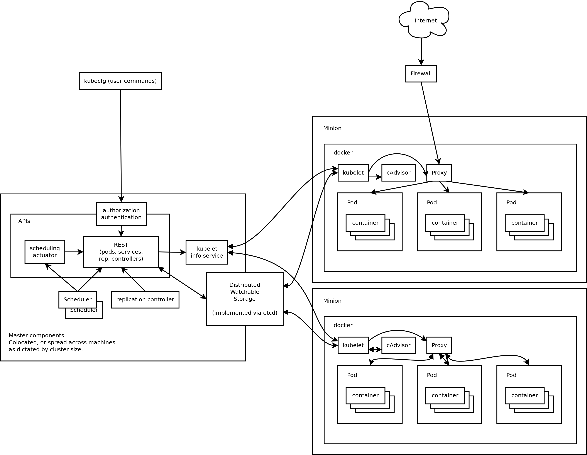
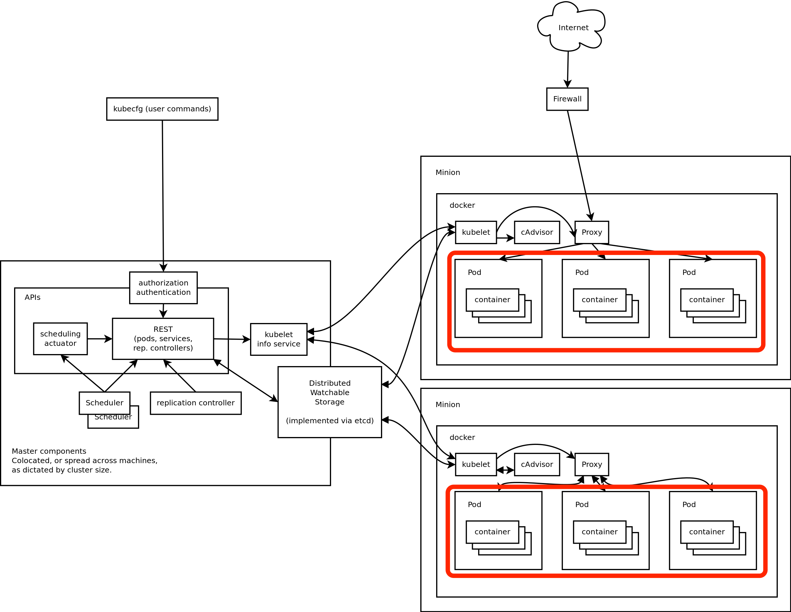

# Kubernetes

--

Kubernetes is a system for managing containerized applications across multiple hosts, providing basic mechanisms for deployment, maintenance, and scaling of applications. Its APIs are intended to serve as the foundation for an open ecosystem of tools, automation systems, and higher-level API layers.

--

## Is Kubernetes, then, a Docker "orchestration" system?
#### Yes and no.

--

# Imperative vs. Declarative

Notes:
Kubernetes establishes robust declarative primitives for maintaining the desired state requested by the user. We see these primitives as the main value added by Kubernetes. Self-healing mechanisms, such as auto-restarting, re-scheduling, and replicating containers require active controllers, not just imperative orchestration.
Kubernetes is primarily targeted at applications comprised of multiple containers, such as elastic, distributed micro-services. It is also designed to facilitate migration of non-containerized application stacks to Kubernetes. It therefore includes abstractions for grouping containers in both loosely coupled and tightly coupled formations, and provides ways for containers to find and communicate with each other in relatively familiar ways.
Kubernetes enables users to ask a cluster to run a set of containers. The system automatically chooses hosts to run those containers on. While Kubernetes's scheduler is currently very simple, we expect it to grow in sophistication over time. Scheduling is a policy-rich, topology-aware, workload-specific function that significantly impacts availability, performance, and capacity. The scheduler needs to take into account individual and collective resource requirements, quality of service requirements, hardware/software/policy constraints, affinity and anti-affinity specifications, data locality, inter-workload interference, deadlines, and so on. Workload-specific requirements will be exposed through the API as necessary.

--

Kubernetes Cluster

Notes:
A single Kubernetes cluster is not intended to span multiple availability zones. Instead, we recommend building a higher-level layer to replicate complete deployments of highly available applications across multiple zones.

--

# Higher Level Layer? --> OpenShift

--

# Architecture

--

 <!-- .element: class="stretch" -->

Notes:
A running Kubernetes cluster contains node agents (kubelet) and master components (APIs, scheduler, etc), on top of a distributed storage solution.

--

# Pods

--

 <!-- .element: class="stretch" -->

Notes:
A pod (as in a pod of whales or pea pod) is a relatively tightly coupled group of containers that are scheduled onto the same host. It models an application-specific "virtual host" in a containerized environment. Pods serve as units of scheduling, deployment, and horizontal scaling/replication, share fate, and share some resources, such as storage volumes and IP addresses.

--
