# Cartridge Development

--

# Cartridge Types

--

* **Primary Cartridges** controls the build lifecycle, responds to scaling events and is the cartridge responsible for providing some external network accessibility
* **Embedded or Secondary Cartridges** cartridges play a supporting role to the primary cartridge, adding capabilities in a more limited fashion

--

# Jenkins as an Example

* __jenkins__ cartridge provides a fully functional Jenkins service that can
be accessed via a web browser (**primary**)
* __jenkins-client__ needs to be embedded with an existing web application as
its role is to simply offload builds to an existing Jenkins service. The
client by itself provides no value without being combined with an existing
primary cartridge

--

# Directory Layout

--

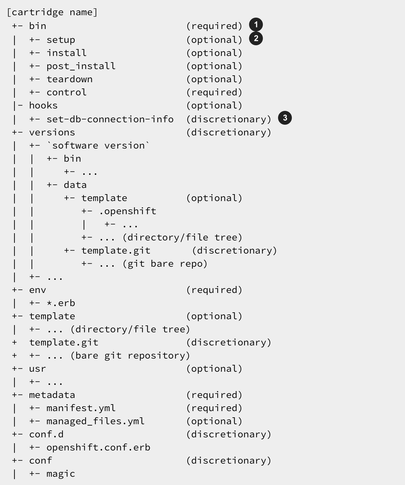

--

# Cartridge Metadata

The `manifest.yml` file is used by OpenShift to determine what features your
cartridge requires and in turn publishes. OpenShift also uses fields in the
`manifest.yml` to determine what data to present to the cartridge user about
your cartridge.

[Example: jbosseap manifest.yml](https://github.com/openshift/origin-server/blob/master/cartridges/openshift-origin-cartridge-jbosseap/metadata/manifest.yml)

--

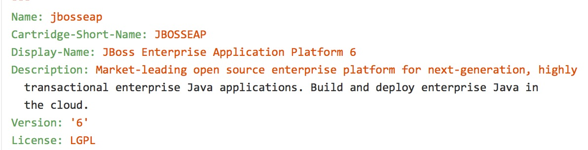

--

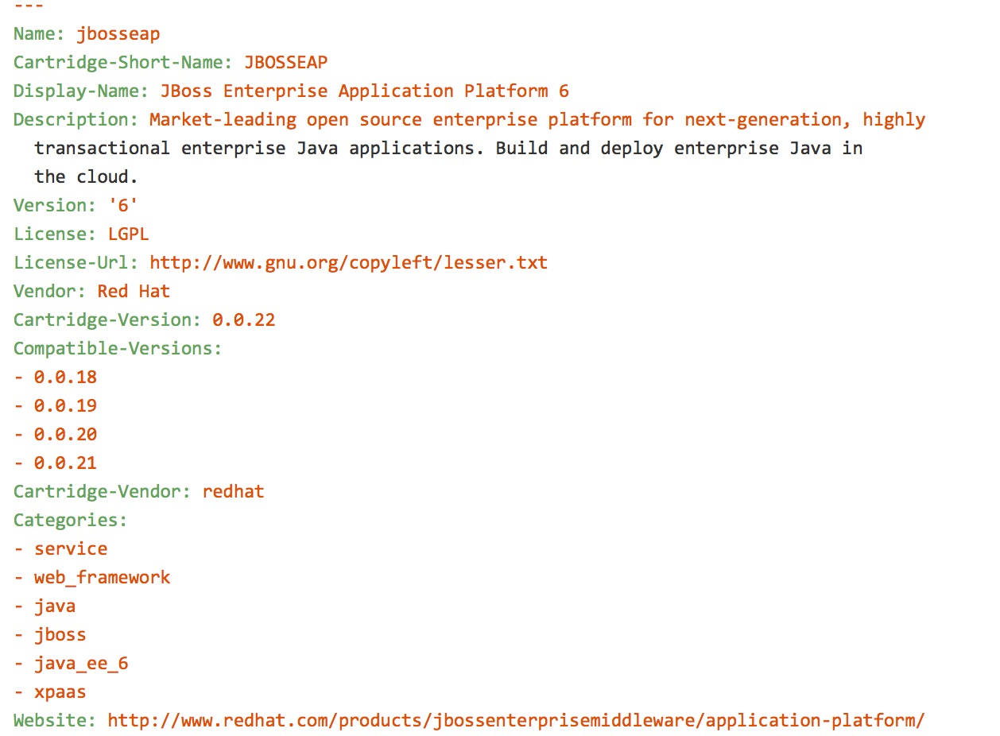

--

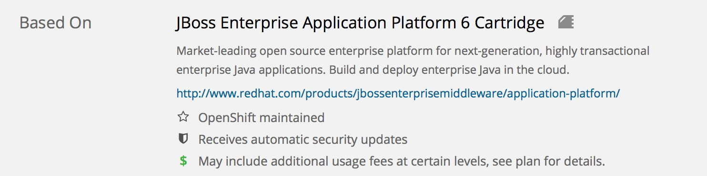

--

### Name: and Vendor:

    Name: jbosseap
    Vendor: Red Hat

The `Cartridge-Vendor` element is used to differentiate cartridges when
installed in the system. As an individual, you should use the same unique
value for all your cartridges to identify yourself; otherwise, use your
company name.

    /var/lib/openshift/.cartridge_repository/
    ├── redhat-amq
    ├── redhat-cron
    ├── redhat-diy
    ├── redhat-fuse
    ├── redhat-fuse-builder
    ├── redhat-haproxy
    ├── redhat-jbosseap
    ├── redhat-jbossews
    ├── redhat-jenkins
    ├── redhat-jenkins-client
    ├── redhat-mock
    ├── redhat-mock-plugin
    ├── redhat-mongodb
    ├── redhat-mysql
    ├── redhat-nodejs
    ├── redhat-perl
    ├── redhat-php
    ├── redhat-postgresql
    ├── redhat-python
    └── redhat-ruby

--

# Cartridge Versions

The `Cartridge-Version` element is a version number identifying a release of
your cartridge to OpenShift. The value follows the format:

    <number>[.<number>[.<number>[...]]]
    Cartridge-Version: 0.0.22

When you publish new versions of your cartridge to OpenShift, this number will
be used to determine what is necessary to upgrade the application developer’s
application.

    /var/lib/openshift/.cartridge_repository/
    ├── redhat-cron
    │   └── 0.0.13
    ├── redhat-diy
    │   └── 0.0.13
    ├── redhat-fuse
    │   └── 0.0.1
    ├── redhat-fuse-builder
    │   └── 0.0.1
    ├── redhat-haproxy
    │   ├── 0.0.20
    │   └── 0.0.22.1
    ├── redhat-jbosseap
    │   ├── 0.0.19
    │   └── 0.0.20
    .
    .
    .

--

# Compatible Versions

Compatible-Versions is a list of past cartridge versions that are compatible
with this version. To be compatible with a previous version, the code changes
you made in this version do not require the cartridge to be restarted or the
application developer’s application to be restarted.

    Compatible-Versions:
    - 0.0.18
    - 0.0.19
    - 0.0.20
    - 0.0.21

By not requiring a restart, you improve the application user’s experience
since no downtime will be incurred from your changes. If the cartridge’s
current version is not in the list when upgraded, the cartridge will be
stopped, the new code will be installed, `setup` will be run, and the cartridge
started.

--

# Multiple Versions

The `Version` element is the default or only version of the software packaged
by this cartridge.

    Version: '2.0.8'

`Versions`is the list of the versions of the software packaged by this
cartridge.

    Versions:
    - '1.2.4'
    - '2.0.8'
    Cartridge-Version: 0.0.3

--

# Multiple Versions and the Console Display

You can control the way multiple Versions are displayed inside the Web UI by
overriding the default definitions

    Version-Overrides:
      '1.2.4':
        Display-Name: Cassandra Database 1.2.4
        Provides:
        - cassandra-1.2.4
        - cassandra

--

# Cartridge Shortname

    Cartridge-Short-Name: JBOSSEAP

OpenShift creates a number of environment variables for you when installing
your cartridge. This shortened name is used when creating those variables. For
example, using the example manifest, the following environment variables would
be created

    OPENSHIFT_JBOSSEAP_DIR
    OPENSHIFT_JBOSSEAP_IP
    OPENSHIFT_JBOSSEAP_PORT
    OPENSHIFT_JBOSSEAP_CLUSTER_PORT
    .
    .
    .

--

# Cartridge Categories

* web_framework
* web_proxy
* service
* embedded
* plugin
* domain_scope

--

# web_framework

The web_framework category is used to describe a primary cartridge that
accepts inbound HTTP and HTTPS as well as WebSocket requests. An application
can have a single cartridge with the web_framework category

--

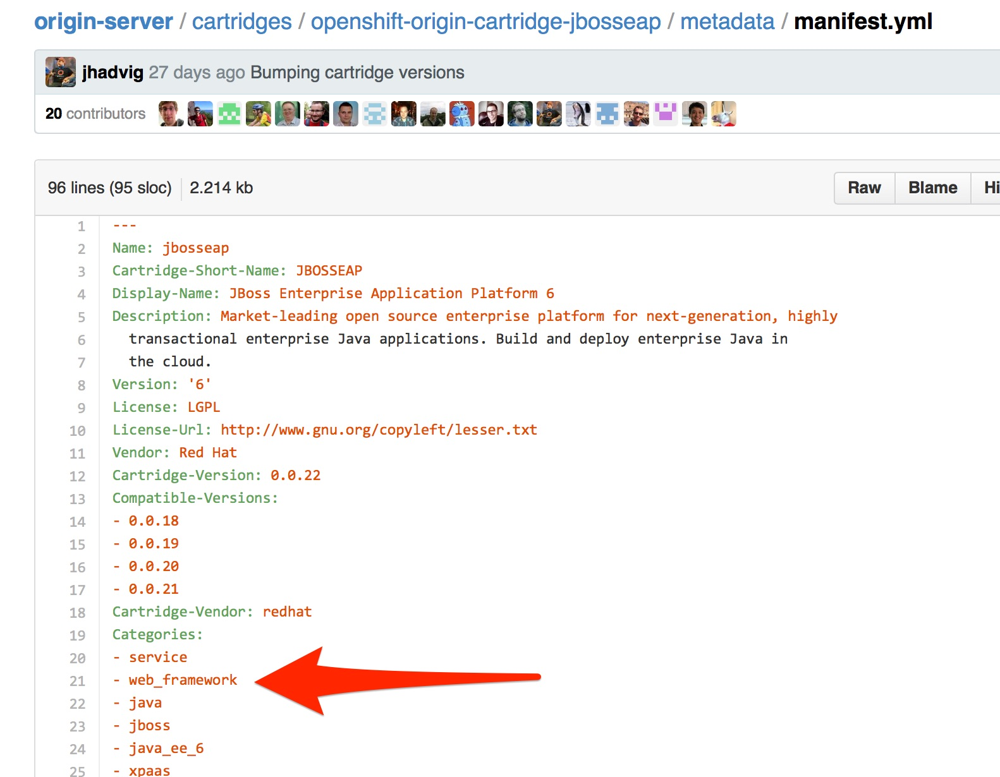

--

# web_proxy

The `web_proxy` category is used to describe a cartridge that is responsible
for routing web traffic to the application’s gears. If a scalable application
is created with a cartridge that has the `web_framework` category, a web_proxy
cartridge is also added to it to enable auto-scaling. Subsequently,
whenever the web_framework cartridge needs to scale beyond a single gear,
the web_proxy cartridge will automatically route to the end point described
by the `Public-Port-Name` with a value of `PROXY_PORT`. The web_proxy will
also be automatically updated with routing rules to address the new gears
over HTTP as they are added. An application can have a single cartridge
with the web_proxy category.

--

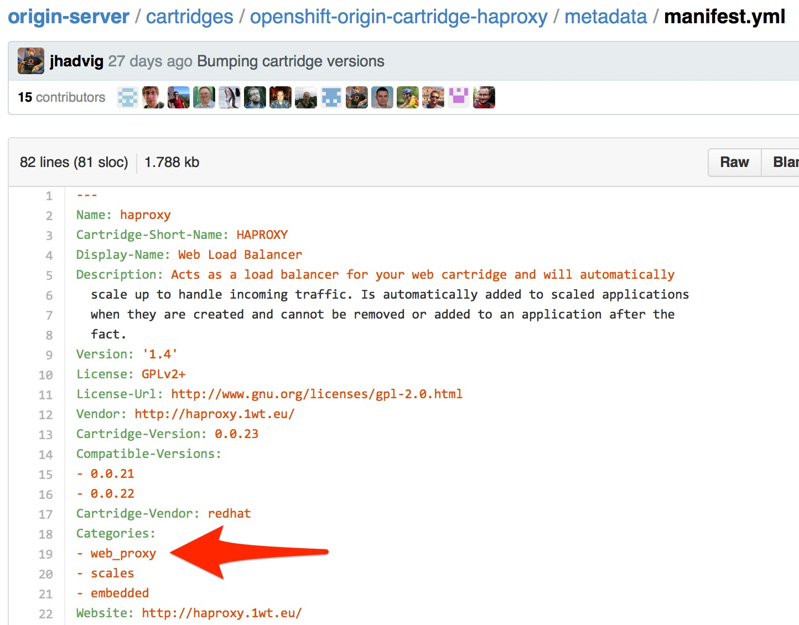

--

# service

The service category is used to describe a primary cartridge that is not
necessarily HTTP-based. This means that the cartridge can scale independently
but is not necessarily addressable outside of the platform. Because of this,
when creating an application in OpenShift, there is a restriction that at least
one web_framework cartridge be present in the application so that the DNS
registration for the application contains at least one well known addressable
endpoint for the application over HTTP. However, in many cases, an application
might need to consist of a web_framework cartridge and other service cartridges
such as MySQL. By using the category of service for a cartridge like MySQL, it
will install the cartridge on separate gears from the web_framework cartridge
and allow it to scale independently as well.

--

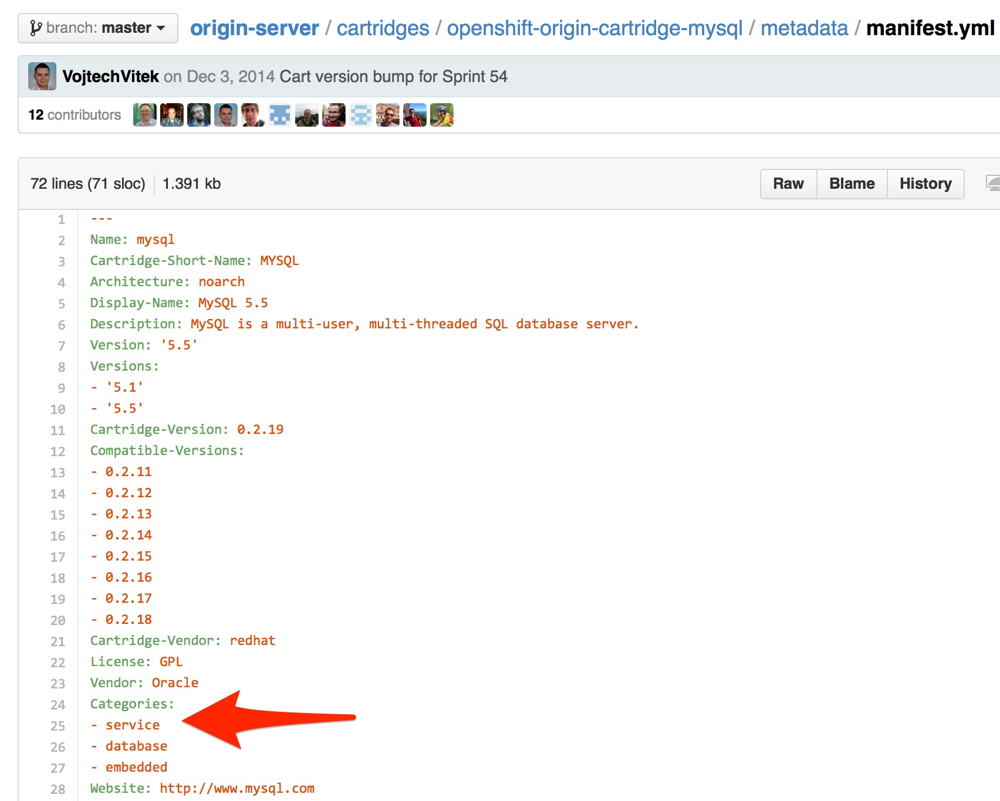

--

# embedded

The `embedded` category is used to describe whether a cartridge can be
co-located with a primary cartridge. It is relevant only in case of non-scalable
applications. This category allows the cartridge to always be co-located or
installed with any other primary cartridge. An example of this would be the
Jenkins client cartridge which can always be combined with any web application
cartridge to offload the builds to a Jenkins service.

--

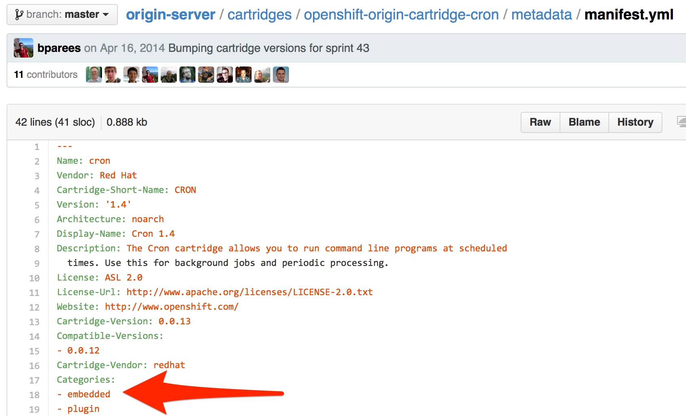

--

# plugin

The `plugin` category is the equivalent of the `embedded` category for scalable
applications. A `plugin` cartridge is designed to be co-located with another
cartridge in a scalable application. It relies upon `Group-Overrides` being
defined to determine which cartridge it should co-locate with. An example of
this is the cron cartridge that is a plugin and specifies through
`Group-Overrides` that it needs to co-locate with the `web_framework` cartridge.

--

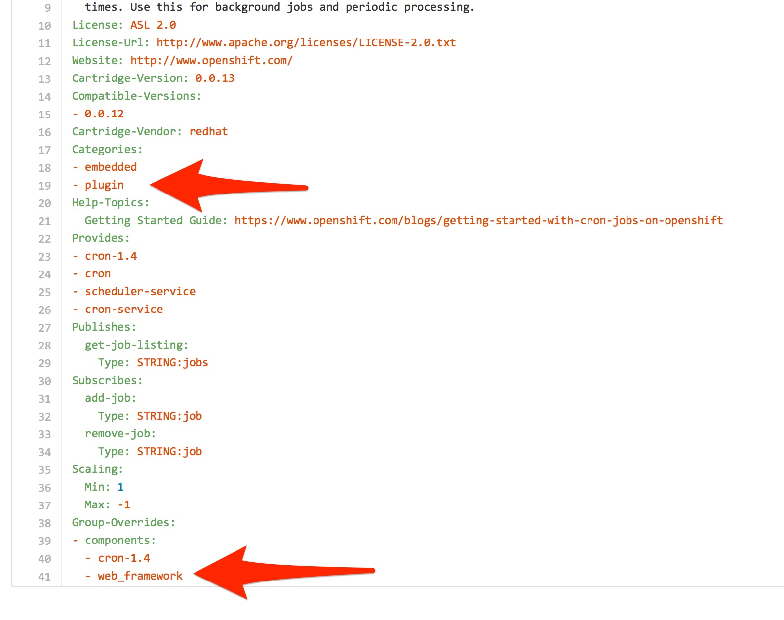

--

# domain_scope

The `domain_scope` category describes a cartridge that can only have a single
instance within the domain. For example, the jenkins server cartridge has the
`domain_scope` category to ensure that there is a single jenkins server
application within the entire domain. All other applications embed the jenkins
client cartridge to enable builds that are handled by the jenkins server.

--

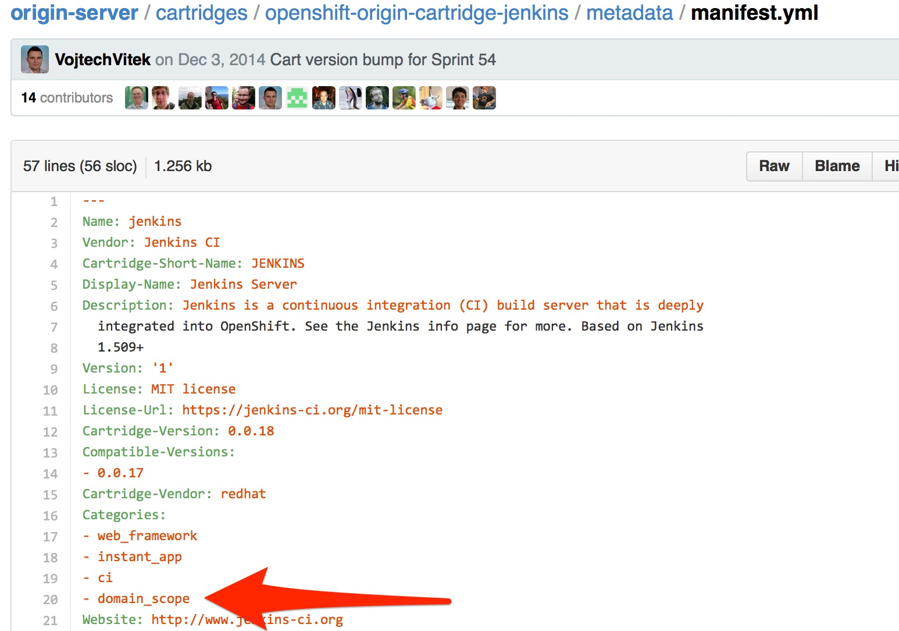

--

# Descriptive Categories

The descriptive categories are primarily used in the OpenShift web console and
the rhc client tools to improve the user experience. In the web console,
descriptive categories show up as tags which allow users to search and quickly
filter the available cartridges. When using the client tools, these categories
are used to apply matching logic on cartridge related operations.

For example, if a user ran:

    rhc add-cartridge jboss

The descriptive categories will be searched in addition to the names of the
cartridges.

--

# Example: jbosseap cartridge

    Categories:
    - service
    - web_framework
    - java
    - jboss
    - java_ee_6
    - xpaas

--

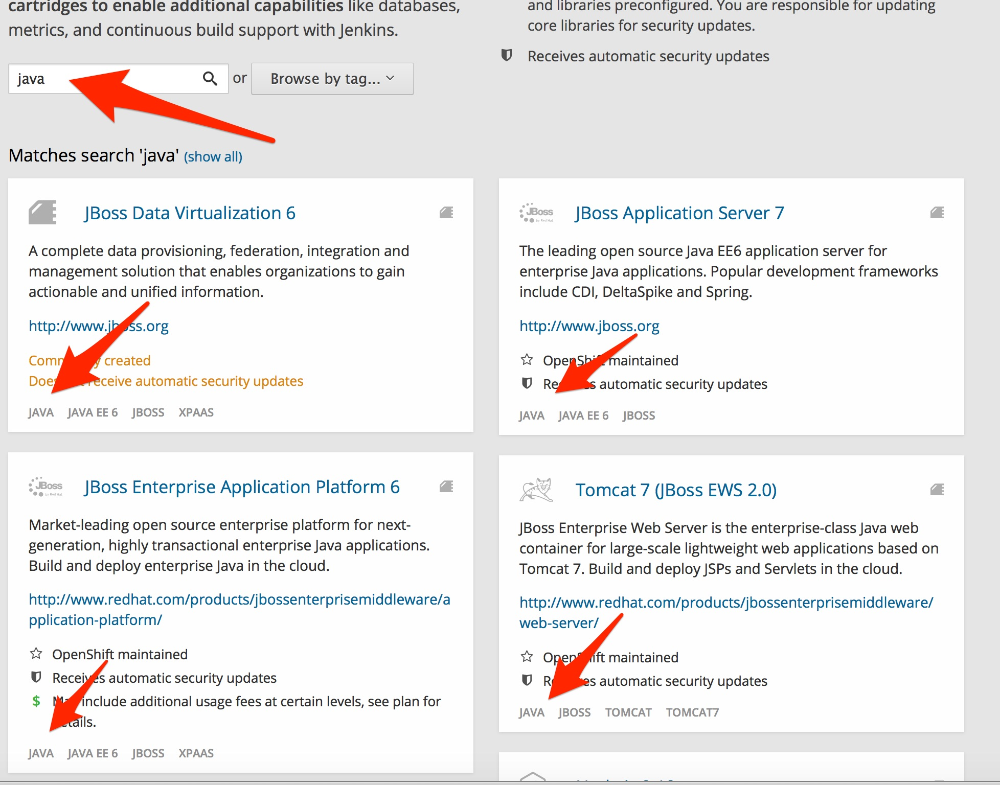

--

# Group Overrides

`Group-Overrides` is applicable in case of scalable applications. By default,
for scalable applications, each cartridge resides on its own gear within its
own group instance. However, sometimes it is required/preferred to have two
cartridges be located together within the same gear. `Group-Overrides` lets
you do this. For example, if you add a `cron` cartridge, you always want it to
colocate with the `web_framework` cartridge.

    Group-Overrides:
    - components:
      - web_framework
      - cron

Similarly, if you would like the `web_framework` cartridge to be located along
with the web_proxy cartridge, then you can specify:

    Group-Overrides:
    - components:
      - web_proxy
      - web_framework

--

# Scaling

    Scaling:
      Min: 1
      Max: -1

This section defines the scaling parameters for a cartridge and is applicable
when the cartridge is added to a scalable application. The `Min` and `Max`
parameters define the scaling limits for the cartridge. Setting both the `Min`
and `Max` equal to 1 indicates that the cartridge cannot scale.

On the other hand, if Max is specified as -1, then there is no maximum
scaling limit and the cartridge can scale up as long as the user’s gear limit
is not exceeded. The scaling limits are enforced during auto-scaling as well
as when setting the cartridge scaling limits manually.

--

# Scaling with Group Overrides

* With `Group-Overrides` the scaling configuration should match. Sometimes this
 is not desirable
* Think `web_proxy` (HA-proxy)
  * Should be co-located with `web_framework` but only in the head gear

* OpenShift provides the `Multiplier` keyword.

[HA-Proxy](https://github.com/openshift/origin-server/blob/master/cartridges/openshift-origin-cartridge-haproxy/metadata/manifest.yml)

    Scaling:
      Min: 1
      Max: 1
      Multiplier: -1

--

# Provides

Provides is a list of features or functionalities that the cartridge provides
to the application

    Provides:
    - jbosseap-6
    - jbosseap
    - jboss-eap6
    - jbosseap-standalone
    - jboss-eap6-standalone

--

# Requires

Requires is a list of features or functionalities that this cartridge depends
upon for its operation. These dependencies would be matched against other
available cartridges to find the ones that provide them. For example, a
framework cartridge like Rails could require a language/runtime cartridge like
Ruby. In this case, if an application is being created with the Rails cartridge,
based on the Requires specification, a cartridge that provides Ruby would be
automatically added to the application.

The functionality specified in the Requires section must identify a single
cartridge. In case multiple cartridges are matched, then the cartridge cannot
be added and an error is raised to the user.

Not really used (as in did not find it in any cartridge)

--

# Source-Url

`Source-Url`is used when you self-distribute your cartridges. They are
downloaded at the time the application is created

    Source-Url: https://github.com/gshipley/openshift-cartridge-oracle-saas.git

--

# Cartridge Reflector

During Cartridge Development you can use the [Cartridge Reflector](https://cartreflect-claytondev.rhcloud.com)
to automatically create the URL for you.

https://github.com/smarterclayton/cartridge-reflector

--

# Additional-Control-Actions

The `Additional-Control-Actions` element is a list of optional actions
supported by your cartridge. `threaddump` is an example of one such action

    Additional-Control-Actions:
    - threaddump

--

# Exposing TCP Endpoints

Most cartridges provide a service by binding to one or many ports. Cartridges
must explicitly declare which ports they will bind to, and provide meaningful
variable names to describe the following:

* Any IP addresses necessary for binding
* The gear-local ports to which the cartridge services will bind
* (Optional) Publicly proxied ports which expose gear-local ports for use by
the application’s users or intra-gear. These endpoint ports are only created
when the application is scalable.

--

# Exposing TCP Endpoints cont.

In addition to IP and port definitions, Endpoints are where front-end httpd
mappings for your cartridge are declared to route traffic from the outside
world to your cartridge’s services.

    Endpoints:
    - Private-IP-Name: IP
      Private-Port-Name: HTTP_PORT
      Private-Port: 8080
      Public-Port-Name: HTTP_PROXY_PORT
      Protocols:
      - http
      - ws
      Options:
        primary: true

--

# Example

    Name: CustomCart
    Cartridge-Short-Name: CUSTOMCART
    # ...
    Endpoints:
      - Private-IP-Name:   HTTP_IP
        Private-Port-Name: WEB_PORT
        Private-Port:      8080
        Public-Port-Name:  WEB_PROXY_PORT

      - Private-IP-Name:   HTTP_IP
        Private-Port-Name: ADMIN_PORT
        Private-Port:      9000
        Public-Port-Name:  ADMIN_PROXY_PORT

      - Private-IP-Name:   INTERNAL_SERVICE_IP
        Private-Port-Name: 5544
        Public-Port-Name:  INTERNAL_SERVICE_PORT

will generate

    # Internal IP/port allocations
    OPENSHIFT_CUSTOMCART_HTTP_IP=<assigned internal IP 1>
    OPENSHIFT_CUSTOMCART_WEB_PORT=8080
    OPENSHIFT_CUSTOMCART_ADMIN_PORT=9000
    OPENSHIFT_CUSTOMCART_INTERNAL_SERVICE_IP=<assigned internal IP 2>
    OPENSHIFT_CUSTOMCART_INTERNAL_SERVICE_PORT=5544

    # Public proxy port mappings
    OPENSHIFT_CUSTOMCART_WEB_PROXY_PORT=<assigned public port 1>
    OPENSHIFT_CUSTOMCART_ADMIN_PROXY_PORT=<assigned public port 2>

--

# Example Mappings

    Endpoints:
      - Private-IP-Name:   HTTP_IP
        Private-Port-Name: WEB_PORT
        Private-Port:      8080
        Public-Port-Name:  WEB_PROXY_PORT
        Mappings:
          - Frontend:      "/web_front"
            Backend:       "/web_back"
          - Frontend:      "/socket_front"
            Backend:       "/socket_back"
            Options:       { "websocket": true }
      - Private-IP-Name:   HTTP_IP
        Private-Port-Name: ADMIN_PORT
        Private-Port:      9000
        Public-Port-Name:  ADMIN_PROXY_PORT
        Mappings:
          - Frontend:      "/admin_front"
          - Backend:       "/admin_back"

will generate

    http://<app dns>/web_front    => http://OPENSHIFT_CUSTOMCART_HTTP_IP:8080/web_back
    http://<app dns>/socket_front => http://OPENSHIFT_CUSTOMCART_HTTP_IP:8080/socket_back
    http://<app dns>/admin_front  => http://OPENSHIFT_CUSTOMCART_HTTP_IP:9000/admin_back

--

# Mapping Options

    Mappings:
              - Frontend:      "/web_front"
                Backend:       "/web_back"
              - Frontend:      "/socket_front"
                Backend:       "/socket_back"
                Options:       { "websocket": true }

* `websocket` - Enable web sockets on a particular path
* `gone` - Mark the path as gone (uri is ignored)
* `forbidden` - Mark the path as forbidden (uri is ignored)
* `noproxy` - Mark the path as not proxied (uri is ignored)
* `redirect` - Use redirection to uri instead of proxy (uri must be a path)
* `file` - Ignore request and load file path contained in uri (must be path)
* `tohttps` - Redirect request to https and use the path contained in the uri
(must be path)

--

# Managed Files

[metadata/managed_files.yml](https://github.com/openshift/origin-server/blob/master/cartridges/openshift-origin-cartridge-jbosseap/metadata/managed_files.yml)

    locked_files:
    processed_templates:
    setup_rewritten:
    dependency_dirs:
    build_dependency_dirs:
    snapshot_exclusions:

--

# locked_files

Important so files are not overwritten or modified through the consumer of
your cartridge (think lifecycle `pre_build` or `post_build`)

    locked_files:
    - bin/
    - bin/*
    - tools/
    - tools/*
    - metadata/
    - metadata/*
    - hooks/
    - hooks/*
    - env/
    - env/OPENSHIFT_JBOSSEAP_DIR
    - env/OPENSHIFT_JBOSSEAP_JDK*
    - env/M2_HOME
    - jboss_cfg_backup/

--

# processed_templates

    processed_templates:
    - 'metadata/jenkins_artifacts_glob.erb'

Definition of ERB Templates. You can also define to process any file with `
.erb` extension.

    processed_templates:
    - '**/*.erb'

ERB Templates eases the process of creating configuration files with dynamic
information

--

# Sample conf.d/openshift.conf.erb

    ServerRoot "<%= ENV['OPENSHIFT_HOMEDIR'] + "/ruby-1.8" %>"
    DocumentRoot "<%= ENV['OPENSHIFT_REPO_DIR'] + "/public" %>"
    Listen <%= ENV['OPENSHIFT_RUBY_IP'] + ':' + ENV['OPENSHIFT_RUBY_PORT'] %>
    User <%= ENV['OPENSHIFT_GEAR_UUID'] %>
    Group <%= ENV['OPENSHIFT_GEAR_UUID'] %>

    ErrorLog "|/usr/sbin/rotatelogs <%= ENV['OPENSHIFT_HOMEDIR']%>/ruby-1.8/logs/error_log-%Y%m%d-%H%M%S-%Z 86400"
    CustomLog "|/usr/sbin/rotatelogs <%= ENV['OPENSHIFT_HOMEDIR']%>/logs/access_log-%Y%m%d-%H%M%S-%Z 86400" combined

    PassengerUser <%= ENV['OPENSHIFT_GEAR_UUID'] %>
    PassengerPreStart http://<%= ENV['OPENSHIFT_RUBY_IP'] + ':' + ENV['OPENSHIFT_RUBY_PORT'] %>/
    PassengerSpawnIPAddress <%= ENV['OPENSHIFT_RUBY_IP'] %>
    PassengerUseGlobalQueue off
    <Directory <%= ENV['OPENSHIFT_REPO_DIR]%>/public>
      AllowOverride all
      Options -MultiViews
    </Directory>

--

# setup_rewritten

Any files created during setup should be added to setup_rewritten section of
metadata/managed_files.yml. These files will be deleted prior to setup being
run during upgrades.

    setup_rewritten:
    - versions/*

--

# dependency_- and build_dependency_dirs

Directories that can be referenced during the build phase as
`$OPENSHIFT_DEPENDENCIES_DIR` and `$OPENSHIFT_BUILD_DEPENDENCIES_DIR`

    dependency_dirs:
    - standalone/deployments: deployments
    build_dependency_dirs:
    - ~/.m2

--

# snapshot_exclusions and restore_transforms

OpenShift uses the `tar` command when backing up and restoring the gear that
contains your cartridge. `snapshot_exclusions` entry contains an array of
patterns of files that will not be backed up or restored.

`restore_transforms` entry contains scripts that will be used to transform
file names during restore.

    snapshot_exclusions:
    - standalone/tmp

--

# Template Directory

--

--

The `template` or `template.git` directory should provide an minimal example of
an application written in the language/framework your cartridge is packaging.
Your application should welcome the application developer to your cartridge and
let them see that your cartridge has indeed been installed and operates. If you
provide a template directory, OpenShift will transform it into a bare git
repository for use by the application developer.

If you provide a template.git directory, OpenShift will copy the directory for
use by the application developer.

[Example JBoss EAP Template](https://github.com/openshift/origin-server/tree/master/cartridges/openshift-origin-cartridge-jbosseap/versions/shared/template)

--

# Marker Files

The sub-directory `.openshift/markers` may contain example files for the
application developer. These files denote behavior you are expected to honor in
your cartridge’s lifecycle (`/bin/control`).

--

# Action Hooks

The sub-directory `.openshift/action_hooks` will contain code the application
developer wishes to be run during lifecycle changes. Examples would be:

    pre_start_`cartridge name`
    post_start_`cartridge name`
    pre_stop_`cartridge name`
    ...

--

# Cartridge Scripts

Scripts will run directly from the cartridge home directory. make sure they
are executable.

    chmod +x bin/*

on Windows

    git update-index --chmod=+x bin/*

--

# Mandatory Scripts

* `control` Command cartridge to report or change state

# Optional Scripts

* `setup` Prepare this instance of cartridge to be operational for the initial
install and each incompatible upgrade
* `install` Prepare this instance of cartridge to be operational for the initial
install
* `post_install` An opportunity for configuration after the cartridge has been
started for the initial install
* `teardown` Prepare this instance of cartridge to be removed

--

# control script lifecycle

* `update-configuration`, `pre-build`, `build`, `deploy`, or `post-deploy`
* `start` Start the software your cartridge controls
* `stop` Stop the software your cartridge controls
* `status` Return an 0 exit status if your cartridge code is running
* `reload` Your cartridge and the packaged software needs to re-read their
configuration information (this operation will only be called if your cartridge
is running)
* `restart` Stop current process and start a new one for the code your
cartridge packages
* `threaddump` If applicable, your cartridge should signal the packaged
software to perform a thread dump
* `tidy` All unused resources should be released (it is at your discretion to
determine what should be done; be frugal as on some systems resources may be very limited)

--

# control script lifecycle (cont.)

* `pre-snapshot` Prepare the cartridge for a snapshot, e.g. dump database to
flat file
* `post-snapshot` Clean up the cartridge after snapshot, e.g. remove database
dump file
* `pre-restore` Prepare the cartridge for restore
* `post-restore` Clean up the cartridge after being restored, load database
with data from flat file

--

# Cartridge Events

Event scripts reside in the `hooks` directory

Publish Events

    Publishes:
      <event name>:
        Type: "<event type>"
      ...

Subscribe to Events

    Subscribes:
      <event name>:
        Type: "<event type>"
      ...

--

# Event Example

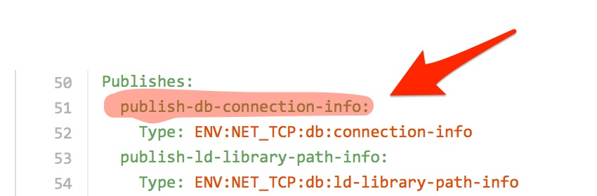

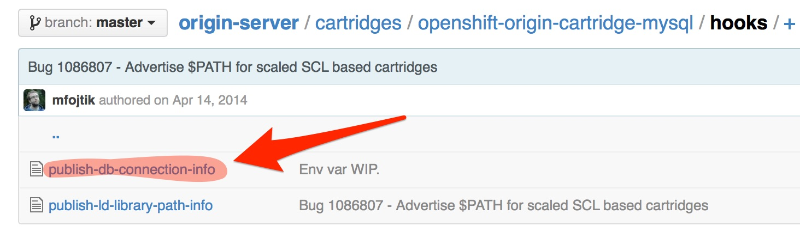

--

# Inside the publish script

    #!/bin/bash

    mysql_url="mysql://$OPENSHIFT_MYSQL_DB_USERNAME:$OPENSHIFT_MYSQL_DB_PASSWORD@$OPENSHIFT_GEAR_DNS:$OPENSHIFT_MYSQL_DB_PROXY_PORT/"

    echo "OPENSHIFT_MYSQL_DB_GEAR_UUID=$OPENSHIFT_GEAR_UUID"
    echo "OPENSHIFT_MYSQL_DB_GEAR_DNS=$OPENSHIFT_GEAR_DNS"
    echo "OPENSHIFT_MYSQL_DB_USERNAME=$OPENSHIFT_MYSQL_DB_USERNAME"
    echo "OPENSHIFT_MYSQL_DB_PASSWORD=$OPENSHIFT_MYSQL_DB_PASSWORD"
    echo "OPENSHIFT_MYSQL_DB_HOST=$OPENSHIFT_GEAR_DNS"
    echo "OPENSHIFT_MYSQL_DB_PORT=$OPENSHIFT_MYSQL_DB_PROXY_PORT"
    echo "OPENSHIFT_MYSQL_DB_URL=$mysql_url"

--

# Resources

* [Windows .NET on OpenShift](https://www.youtube.com/watch?v=rtubl2QyqKQ)
* [Screencast on IBM WAS on OpenShift](https://mojo.redhat.com/videos/927603)
* [Cartridge Development Guide](http://www.openshift.org/documentation/oo_cartridge_developers_guide.html)
* [Cartridge Reflector](http://cartreflect-claytondev.rhcloud.com)
* [Websphere Cartridge](https://github.com/juhoffma/openshift-origin-websphere-cartridge)
* [Weblogic Cartridge](https://github.com/juhoffma/openshift-origin-weblogic-cartridge)
* [Cassandra Cartridge](https://github.com/juhoffma/openshift-origin-cartridge-cassandra)
