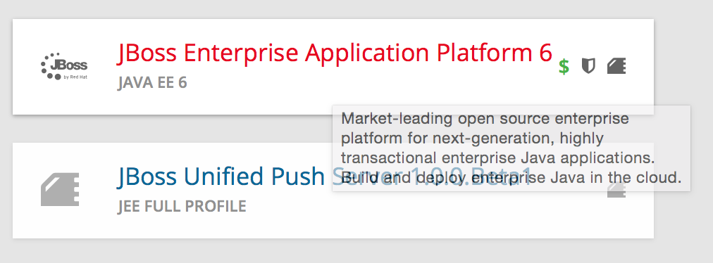

# Cartridge Development

--

# Cartridge Types

--

* **Primary Cartridges** controls the build lifecycle, responds to scaling events and is the cartridge responsible for providing some external network accessibility
* **Embedded or Secondary Cartridges** cartridges play a supporting role to the primary cartridge, adding capabilities in a more limited fashion

--

# Jenkins as an Example

* __jenkins__ cartridge provides a fully functional Jenkins service that can
be accessed via a web browser (**primary**)
* __jenkins-client__ needs to be embedded with an existing web application as
its role is to simply offload builds to an existing Jenkins service. The
client by itself provides no value without being combined with an existing
primary cartridge

--

# Directory Layout

--

--

# Cartridge Metadata

The `manifest.yml` file is used by OpenShift to determine what features your
cartridge requires and in turn publishes. OpenShift also uses fields in the
`manifest.yml` to determine what data to present to the cartridge user about
your cartridge.

[Example: jbosseap manifest.yml](https://github.com/openshift/origin-server/blob/master/cartridges/openshift-origin-cartridge-jbosseap/metadata/manifest.yml)

--

--

--

--

### Name: and Vendor:

    Name: jbosseap
    Vendor: Red Hat

The `Cartridge-Vendor` element is used to differentiate cartridges when
installed in the system. As an individual, you should use the same unique
value for all your cartridges to identify yourself; otherwise, use your
company name.

    /var/lib/openshift/.cartridge_repository/
    ├── redhat-amq
    ├── redhat-cron
    ├── redhat-diy
    ├── redhat-fuse
    ├── redhat-fuse-builder
    ├── redhat-haproxy
    ├── redhat-jbosseap
    ├── redhat-jbossews
    ├── redhat-jenkins
    ├── redhat-jenkins-client
    ├── redhat-mock
    ├── redhat-mock-plugin
    ├── redhat-mongodb
    ├── redhat-mysql
    ├── redhat-nodejs
    ├── redhat-perl
    ├── redhat-php
    ├── redhat-postgresql
    ├── redhat-python
    └── redhat-ruby

--

# Cartridge Versions

The `Cartridge-Version` element is a version number identifying a release of
your cartridge to OpenShift. The value follows the format:

    <number>[.<number>[.<number>[...]]]
    Cartridge-Version: 0.0.22

When you publish new versions of your cartridge to OpenShift, this number will
be used to determine what is necessary to upgrade the application developer’s
application.

    /var/lib/openshift/.cartridge_repository/
    ├── redhat-cron
    │   └── 0.0.13
    ├── redhat-diy
    │   └── 0.0.13
    ├── redhat-fuse
    │   └── 0.0.1
    ├── redhat-fuse-builder
    │   └── 0.0.1
    ├── redhat-haproxy
    │   ├── 0.0.20
    │   └── 0.0.22.1
    ├── redhat-jbosseap
    │   ├── 0.0.19
    │   └── 0.0.20
    .
    .
    .

--

# Compatible Versions

Compatible-Versions is a list of past cartridge versions that are compatible
with this version. To be compatible with a previous version, the code changes
you made in this version do not require the cartridge to be restarted or the
application developer’s application to be restarted.

    Compatible-Versions:
    - 0.0.18
    - 0.0.19
    - 0.0.20
    - 0.0.21

By not requiring a restart, you improve the application user’s experience
since no downtime will be incurred from your changes. If the cartridge’s
current version is not in the list when upgraded, the cartridge will be
stopped, the new code will be installed, `setup` will be run, and the cartridge
started.

--

# Multiple Versions

The `Version` element is the default or only version of the software packaged
by this cartridge.

    Version: '2.0.8'

`Versions` is the list of the versions of the software packaged by this
cartridge.

    Versions:
    - '1.2.4'
    - '2.0.8'
    Cartridge-Version: 0.0.3

--

# Multiple Versions and the Console Display

You can control the way multiple Versions are displayed inside the Web UI

    Version-Overrides:
      '1.2.4':
        Display-Name: Cassandra Database 1.2.4
        Provides:
        - cassandra-1.2.4
        - cassandra

--

# Cartridge Shortname

    Cartridge-Short-Name: JBOSSEAP

OpenShift creates a number of environment variables for you when installing
your cartridge. This shortened name is used when creating those variables. For
example, using the example manifest, the following environment variables would
be created

    OPENSHIFT_JBOSSEAP_DIR
    OPENSHIFT_JBOSSEAP_IP
    OPENSHIFT_JBOSSEAP_PORT
    OPENSHIFT_JBOSSEAP_CLUSTER_PORT
    .
    .
    .

--

# Cartridge Categories

* web_framework
* web_proxy
* service
* embedded
* plugin
* domain_scope

--

# web_framework

The web_framework category is used to describe a primary cartridge that
accepts inbound HTTP and HTTPS as well as WebSocket requests. An application
can have a single cartridge with the web_framework category

--

--

# web_proxy

The `web_proxy` category is used to describe a cartridge that is responsible
for routing web traffic to the application’s gears. If a scalable application
is created with a cartridge that has the `web_framework` category, a web_proxy
cartridge is also added to it to enable auto-scaling. Subsequently,
whenever the web_framework cartridge needs to scale beyond a single gear,
the web_proxy cartridge will automatically route to the end point described
by the `Public-Port-Name` with a value of `PROXY_PORT`. The web_proxy will
also be automatically updated with routing rules to address the new gears
over HTTP as they are added. An application can have a single cartridge
with the web_proxy category.

--

--

# service

The service category is used to describe a primary cartridge that is not
necessarily HTTP-based. This means that the cartridge can scale independently
but is not necessarily addressable outside of the platform. Because of this,
when creating an application in OpenShift, there is a restriction that at least
one web_framework cartridge be present in the application so that the DNS
registration for the application contains at least one well known addressable
endpoint for the application over HTTP. However, in many cases, an application
might need to consist of a web_framework cartridge and other service cartridges
such as MySQL. By using the category of service for a cartridge like MySQL, it
will install the cartridge on separate gears from the web_framework cartridge
and allow it to scale independently as well.

--

--

# embedded

The `embedded` category is used to describe whether a cartridge can be
co-located with a primary cartridge. It is relevant only in case of non-scalable
applications. This category allows the cartridge to always be co-located or
installed with any other primary cartridge. An example of this would be the
Jenkins client cartridge which can always be combined with any web application
cartridge to offload the builds to a Jenkins service.

--

--

# plugin

The `plugin` category is the equivalent of the `embedded` category for scalable
applications. A `plugin` cartridge is designed to be co-located with another
cartridge in a scalable application. It relies upon `Group-Overrides` being
defined to determine which cartridge it should co-locate with. An example of
this is the cron cartridge that is a plugin and specifies through
`Group-Overrides` that it needs to co-locate with the `web_framework` cartridge.

--

--

# domain_scope

The `domain_scope` category describes a cartridge that can only have a single
instance within the domain. For example, the jenkins server cartridge has the
`domain_scope` category to ensure that there is a single jenkins server
application within the entire domain. All other applications embed the jenkins
client cartridge to enable builds that are handled by the jenkins server.

--

--

# Descriptive Categories

The descriptive categories are primarily used in the OpenShift web console and
the rhc client tools to improve the user experience. In the web console,
descriptive categories show up as tags which allow users to search and quickly
filter the available cartridges. When using the client tools, these categories
are used to apply matching logic on cartridge related operations.

For example, if a user ran:

    rhc add-cartridge jboss

The descriptive categories will be searched in addition to the names of the
cartridges.

--

# Example: jbosseap cartridge

    Categories:
    - service
    - web_framework
    - java
    - jboss
    - java_ee_6
    - xpaas

--

--

# Group Overrides

`Group-Overrides` is applicable in case of scalable applications. By default,
for scalable applications, each cartridge resides on its own gear within its
own group instance. However, sometimes it is required/preferred to have two
cartridges be located together within the same gear. `Group-Overrides` lets
you do this. For example, if you add a `cron` cartridge, you always want it to
colocate with the `web_framework` cartridge.

    Group-Overrides:
    - components:
      - web_framework
      - cron

Similarly, if you would like the `web_framework` cartridge to be located along
with the web_proxy cartridge, then you can specify:

    Group-Overrides:
    - components:
      - web_proxy
      - web_framework

