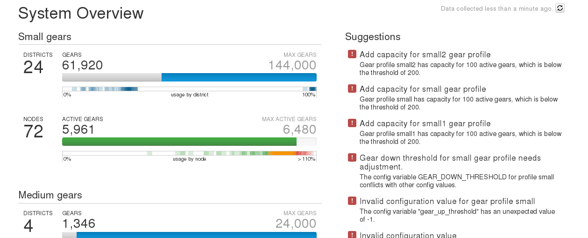
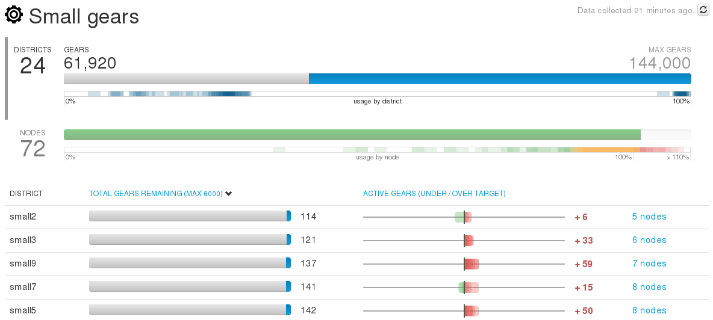
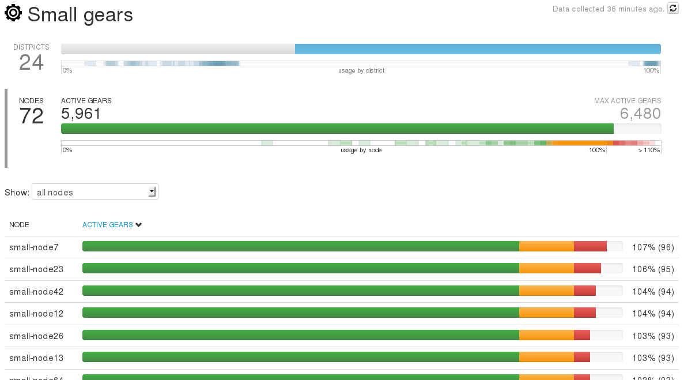
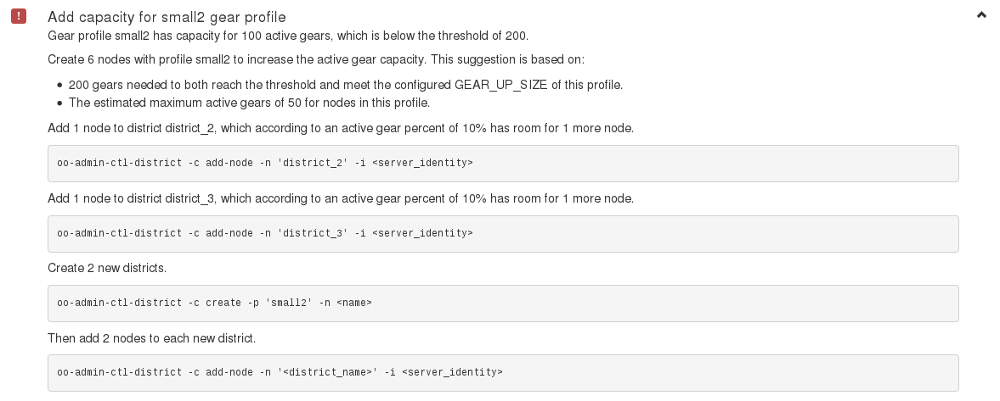
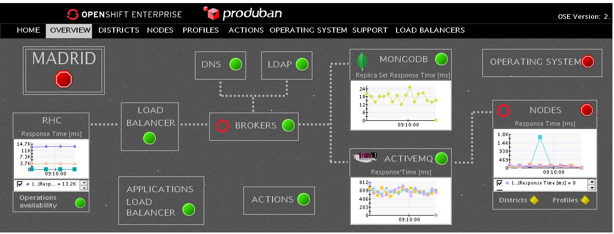

### Monitoring OSE Infrastructure

---
###Monitoring Best Practices
#####General System Checks

* Use standard system administration checks to monitor the basic health of your system:
        - ensure adequate memory
        - minimize disk swapping
        - ensure adequate disk space
        - monitor file system health 
* Monitor the services used by OpenShift Enterprise:
        - MCollective
        - Mongo
        - Apache
        - ActiveMQ
        - SELinux and cgroups

--
###Monitoring Best Practices
#####BROKER

* __`oo-accept-broker`__
  - checks that your broker setup is valid and functional (basic test)
* __`oo-admin-chk`__
  - checks the consistency throughout all node hosts and gears in an OpenShift Enterprise deployment
* __`oo-accept-systems`__
  - verify that the settings on node hosts are valid and can be used by a broker host
* __`oo-mco ping`__ (check that nodes respond to MCollective)
* __`oo-stats`__ (check capacity)

---
###Monitoring Best Practices
#####NODES

* __`oo-accept-node`__
  - checks that node setup is valid and functional and its gears are in good condition
  - check Selinux status (enforcing)
  - check Iptables status (make sure rules are loaded)
* __`oo-idler-stats`__ (displays basic statistics about gears on a node)

__Try to keep ex-nodes as similar as possible and monitor to ensure this__

---
###Monitoring Best Practices
#####MongoDB

* Replica set health
* DB size
* Addition / removal of indexes
* Many other DB related metrics (eg: Mikoomi)
* Rpm consistency check with other Mongo nodes
* Mongo process / port

* Mikoomi project: https://code.google.com/p/mikoomi/wiki/03 (__`MongoDB Plugin`__ for Zabbix to monitor standalone, replicated as well as clustered MongoDB instances)

---

##Some monitoring tools

* __Openshift Admin console__
* __Zabbix__ ---> Reference Architecture available and used by Openshift online
* CA Wily Introscope EPAgent (eg: Produban)
* ....................

--

##Openshift Admin console

* An optional Administration Console is available for OpenShift Enterprise
* Allows administrators to search and navigate entities to plan the capacity of an OpenShift Enterprise deployment.

__The Administration Console is read-only__, so the settings or data cannot be modified.

--

##Accessing the Openshift Admin console

* The Administration Console runs as a plug-in to the OpenShift Enterprise broker application
        Configuration file /etc/openshift/plugins.d/openshift-origin-admin-console.conf
* By default does not provide access control __You must log in to an OpenShift Enterprise host__
* You can enable external access by modifying the broker host httpd proxy configuration
* You can also configure authentication based on: user credentials, kerberos, htpasswd, host name, client IP or LDAP.

--

##Openshift Admin console

 <!-- .element: class="noshadow" -->
--

##Openshift Admin console

 <!-- .element: class="noshadow" -->
--

##Openshift Admin console

 <!-- .element: class="noshadow" -->
--

##Openshift Admin console

 <!-- .element: class="noshadow" -->

--
##Zabbix

* OpenShift Online's Zabbix scripts and monitoring bits 
https://github.com/openshift/openshift_zabbix

* Zabbix Monitoring Cartridges for OpenShift
https://blog.openshift.com/introducing-zabbix-monitoring-cartridges-for-openshift/

--

###CA Wily Introscope EPAgent @ Produban

 <!-- .element: class="noshadow" fullscreen-size="contain"-->

https://github.com/Produban/OpenShift20_Monitoring

