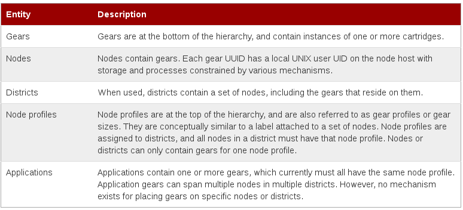
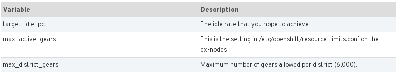
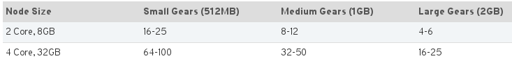

## OpenShift sizing guidelines##

---
###Openshift Enterprise Entities##
 <!-- .element: class="noshadow" fullscreen-size="contain"-->

---

##Districts

* Districts are a logical grouping of nodes and facilitate gears movement between node hosts
* The purpose of districts is to allow for gears to have assigned externally visible ports
* There are ~30k ephemeral ports that can be used and each gear can have up to 5 ports
* This means that a district can have at a maximum 6,000 gears (30k / 5).
* You can have as many districts as you wish
* You can put as many nodes in a district as you wish

--

#### What happens when all 6,000 gears are used, but there is still active capacity left in the district ?

######That active capacity is wasted !!

#####To avoid this issue, do some minimal planning up front based on a few variables.

 <!-- .element: class="noshadow" fullscreen-size="contain"-->
```
(max_district_gears * (1.0 – target_idle_pct)) / max_active_gears
```
--

###District Planning Best Practices
####Example

```
target_idle_pct – 90%
max_active_gears – 40
max_district_gears – 6000 right now
(max_district_gears * (1.0 – target_idle_pct)) / max_active_gears
(6000 * (1.0 – 0.90)) / 40 = 15
```

* So each district should never have more than 15 nodes in it

##### - Warning: It is easy to add nodes to a district, and difficult to remove them !

--

###What do you do if you either fail to plan, or your values were wrong ?
 

- You may have to do district compaction

- District compaction is moving all of the gears off of a node in a district in order to free up a districts wasted active capacity

---

###How Many OpenShift Nodes do I need ?

  -  Nodes are primarily defined by two factors: Memory and Storage.
  -  Node Planning or allocation is more or less based on the number and type of Gears you plan to support.

* Example: Assuming a node size of 2 Core, 8GB or 4 Core, 32GB, and Gear Sizes of 512MB, 1GB and 

 <!-- .element: class="noshadow" fullscreen-size="contain"-->

--

###How Many OpenShift Nodes do I need ?###

- How much capacity (i.e. total # of applications) do you want to be able to support in your PaaS ?
   - One application consumes at least 1 Gear
   - One application may consume 3 or more Gears if auto-scaling is enabled and/or if the DB (i.e. MySQL, Postgresql) runs in OpenShift
- What types of applications do you want to run ?
   - LAMP app runtimes can use Small Gears (512 MB)
   - JBoss EAP typically requires Medium or Large Gears (1 GB or 2 GB)
- Do you want PaaS environments for Development, Testing, Staging, Production, etc. or all of the above ?
   - If so are you counting on duplication of the application between the different environments ?
---

###Gears Capacity Planning for Nodes

- Districts and nodes have separate capacity limits for the number of gears allowed on each

- Nodes only limits the number of active gears
   - max_active_gears parameter set in   /etc/openshift/resource_limits.conf
   - Node can have any number of inactive gears, constrained only by storage
- max_active_gears limit is based on the resource most likely to be exhausted first: typically RAM and divide the amount of available resource by it
        For example, consider a node with 7.5 GB of RAM available and gears constrained to 0.5, then 
		max_active_gears = 7.5 GB / 0.5 GB = 15 gears
	 
Notes:
In practise, node are rarely used to the limit, so node can be “over-committed”
max_gears can be modify after installation but ......
--

###Default Gear Quotas

Broker's /etc/openshift/broker.conf:

		# Comma-separated list of valid gear sizes available anywhere in the installation
		VALID_GEAR_SIZES="small,medium"
		# Default number of gears to assign to a new user
		DEFAULT_MAX_GEARS="100"
		# Default gear size for a new gear if not otherwise specified
		DEFAULT_GEAR_SIZE="small"
		# Default gear sizes (comma-separated) allowed to a new user
		DEFAULT_GEAR_CAPABILITIES="small"
		# Limits number of domains by user
		DEFAULT_MAX_DOMAINS="5"
--

###Setting gear quotas for specific users

Changing one user max_gears:

		# oo-admin-ctl-user -l username --setmaxgears 101
		Setting max_gears to 101... Done.
		User username:
		consumed gears: 3
		max gears: 101
		gear sizes: small
---
###How many OpenShift brokers do I need ?

- Brokers are Red Hat Enterprise Linux (RHEL) instances that act as a central controller for a set of nodes

- With an OpenShift broker there are several parts that can all be duplicated on the same host, or separated on to individual hosts for HA
        These services are: 
		- BIND / DNS
		- MongoDB (Redundancy is achieved via replica sets)
		- ActiveMQ (Set up in a Network-of-Brokers configuration)

