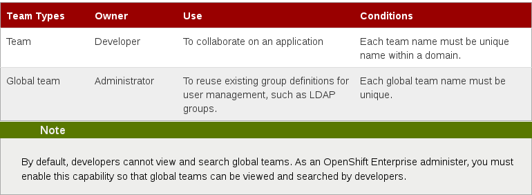

# Introduction to Teams

 <!-- .element: class="stretch" -->

--
# Teams and roles
###The following team roles are available: view, edit, and admin.

- View
####Domain level: view the details of an application but will not be able to clone the Git repository, SSH to the gear, stop or start the application, or embed add-on cartridges#

- Edit
####Domain level: Adding cartridges, creating new applications, deleting applications, viewing and changing source code and triggering new deployments#

- Admin
####Full control of the domain#

######If you have a specific role, and you are on a team that has a different role, the effective role is the higher of the two roles 

Notes:
######Ideally customers would like to just use their current AD and sync from there. So to me this looks like they should be using global teams. But in the user guide Note 1. is reported that you are limited to 100 members. If they sync a group with more members than MAX_MEMBERS_PER_RESOURCE, oo-admin-ctl-team will display an error telling them the group has too many members.
######Membership limits are for performance, since team members are denormalized to all domains and applications the team has access to. They can raise the limit using the MAX_MEMBERS_PER_RESOURCE broker config variable
######https://access.redhat.com/documentation/en-US/OpenShift_Enterprise/2/html-single/User_Guide/index.html#Adding_Application_Developers_to_a_Team
